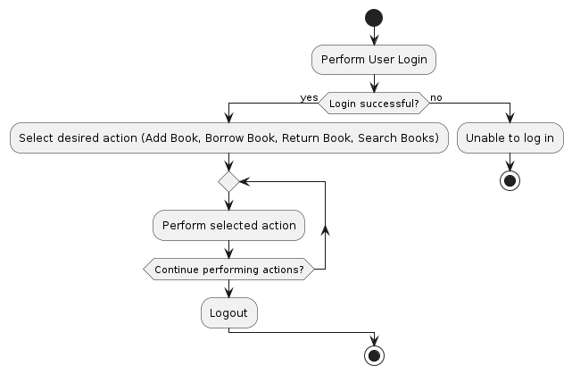

# Software

**Note**: The following documentation outlines the software development process using the Agile V-Model, which combines Agile methodologies with a V+V-centric approach. Each section provides a clear description of its purpose and what to focus on during that phase of the development lifecycle.

**Guidelines for Agile V-Model Implementation**: Align each sprint with the V-Model phases. Each sprint should become a "mini V" with development and integration/test activities. Consider combining development and integration within a single sprint for efficiency, while alternating between sprints might be suitable for high-complexity projects with dependencies. Utilize a "Sprint 0" if necessary for project preparation. This can include creating an initial story map and component architecture, which are crucial for subsequent sprint planning.

## Requirements

**Purpose**: Define and gather the system's functional, design, and operational requirements.

**Requirements Specification Document**: Describe the scope, features, and functionalities of the software system. Include functional requirements (features, deliverables, logic), design requirements (quality, portability, performance), and operational requirements (maintenance, security, support).

**Tools**: Consider using specialized requirement management tools like IBM Engineering Requirements Management DOORS or Jama Connect for traceability and change management.

### Functional Requirements

| ID      | Requirement Title      | Description                                                                  | Priority | Status     | Test Cases | Owner         | Created Date |
|---------|------------------------|------------------------------------------------------------------------------|----------|------------|------------|---------------|--------------|
| FR-001  | User Authentication    | Users must authenticate to access the system                                 | High     | Open       | 0          | Security Team | 2023-08-01   |
| FR-002  | Add Book               | Users can add new books to the library catalog                               | Medium   | In-Progress| 0          | Librarian Team| 2023-08-02   |
| FR-003  | Borrow Book            | Users can borrow books from the library                                      | High     | Open       | 0          | Library Staff | 2023-08-03   |
| FR-004  | Return Book            | Users can return borrowed books to the library                               | Medium   | Closed     | 3          | Librarian Team| 2023-08-04   |
| FR-005  | Search Books           | Users can search for books in the library catalog                            | Low      | Open       | 0          | Security Team | 2023-08-01   |
| FR-[...]| [Requirement Title]    | [Description]                                                                | [Priority]| [Status]  | [?]        | [Owner]       | [Date]       |


### Non-Functional Requirements
| ID      | Requirement Title      | Description                                                                  | Priority | Status     | Test Cases | Owner         | Created Date |
|---------|------------------------|------------------------------------------------------------------------------|----------|------------|------------|---------------|--------------|
| NFR-001 | Performance            | The system must respond to user actions within 2 seconds                     | High     | In-Progress| 0          | Tech Lead     | 2023-08-01   |
| NFR-002 | Security               | User passwords must be stored securely using hashing and salting             | High     | Closed     | 5          | Security Team | 2023-08-02   |
| NFR-003 | Medium                 | The system should be able to handle at least 1000 concurrent users           | Open     | In-Progress| 0          | Tech Lead     | 2023-08-03   |
| NFR-004 | Accessibility          | The system's user interface must be accessible to users with disabilities    | Medium   | In-Progress| 0          | UI/UX Team    | 2023-08-04   |
| NFR-005 | Backup and Recovery    | The system must have daily automated backups and the ability to restore data | Low      | Open       | 0          | SysAdmin Team | 2023-08-05   |
| NFR-[...] | [Requirement Title]  | [Description]                                                                | [Priority] | [Status] | [?]        | [Owner]       | [Date]       |


## Architecture Design

**Purpose**: Define the system architecture and design based on the gathered requirements.

**System Architecture Design Document**: Provide an overview of the high-level system architecture, including components, modules, and their interactions. Use the 4+1 view model to graphically depict different architectural views.

**Component Descriptions**: Detail the functionalities of each component or module. Include potential decompositions into sub-components if necessary.

**Component Interfaces**: Specify interfaces precisely in terms of data exchanged, data direction, triggering component, and detailed data structure descriptions.

### Logical View

**Purpose**: Show functionality and logical structure using class diagrams and package diagrams to illustrate class relationships and organization.

<div hidden>
@startuml LogicalView
package "User Management" {
    [User]
    [Authentication]
}

package "Catalog Management" {
    [Book]
    [Catalog]
}

package "Library System" {
    [Library Member]
    [Borrowing]
    [Returning]
    [Searching]
}

[User] --> [Authentication]
[Library Member] --> [Authentication]
[Library Member] --> [Borrowing]
[Library Member] --> [Returning]
[Library Member] --> [Searching]
[Book] --> [Catalog]
[Catalog] --> [Borrowing]
[Catalog] --> [Searching]
@enduml
</div>


### Development View

**Purpose**: Represent physical organization using component diagrams and package diagrams to show component grouping and distribution.

<div hidden>
@startuml DevelopmentView
[User Interface] --> [Business Logic]
[Business Logic] --> [Data Access]
[Business Logic] --> [External Services]
[Data Access] --> [Database]
@enduml
</div>


### Process View

**Purpose**: Depict dynamic behavior and interactions with  activity or sequence diagrams and communication diagrams to illustrate runtime collaboration.

<div hidden>
@startuml ProcessView
|User|
start
:Perform User Login;
if (Login successful?) then (yes)
  :Select desired action (Add Book, Borrow Book, Return Book, Search Books);
  repeat
    :Perform selected action;
  repeat while (Continue performing actions?)
  :Logout;
else (no)
  |User|
  :Unable to log in;
  stop
endif
|User|
stop
@enduml
</div>



### Physical View

**Purpose**: Focus on deployment with deployment diagrams to showcase distribution across nodes and servers.

<div hidden>
@startuml PhysicalView
!define AWSPUML https://raw.githubusercontent.com/awslabs/aws-icons-for-plantuml/v16.0/dist
!include AWSPUML/AWSCommon.puml
!define EC2 smallOrange
!define S3 smallBlue
!define RDS smallPurple
!define ELB smallGreen
!define ASG smallGrey

!includeurl AWSPUML/AWSCommon.puml
!define iconsize 80

!define AWSPUML https://raw.githubusercontent.com/awslabs/aws-icons-for-plantuml/v14.0/dist

!define iconsize 80

cloud {
    !define iconsize 100
    [User Device]
}

node "Amazon Elastic Load Balancing" as elb {
    [Load Balancer] as elb_lb
}

node "Amazon EC2 Auto Scaling" as asg {
    [Auto Scaling Group] as asg_group
    [Auto Scaling Group] as asg_group2
}

node "Amazon RDS" as rds {
    [Database] as rds_db
}

node "Amazon S3" as s3 {
    [Object Storage] as s3_storage
}

cloud {
    !define iconsize 60
    [Amazon CloudFront]
    [Amazon CloudWatch]
    [Amazon Route 53]
}

cloud {
    !define iconsize 100
    [User Device]
}

[User Device] --> [Load Balancer]

[Load Balancer] --> [Auto Scaling Group]
[Load Balancer] --> [Auto Scaling Group]

[Auto Scaling Group] --> [Database]
[Auto Scaling Group] --> [Object Storage]

[Object Storage] --> [Amazon CloudFront]
[Object Storage] --> [Amazon CloudWatch]
[Object Storage] --> [Amazon Route 53]
@enduml
</div>


### Use Case View
**Purpose**: Present functionality from a user's perspective with use case diagrams and activity diagrams to illustrate user interactions and tasks.


### Use Case 1: User Login
**Description**: A user wants to log in to the library system.

**Actors**: User

**Preconditions**: The user has a registered account.

**Steps**:
- The user enters their username and password.
- The system validates the credentials.
- If the credentials are valid, the user is granted access.

**Postconditions**: The user is logged in and can access the system.

<div hidden>
@startuml UseCase001UserLogin
actor User
User -> System: Enter username and password
System -> Database: Validate credentials
Database --> System: Valid credentials
System --> User: Grant access
@enduml
</div>


### Use Case 2: Add Book
**Description**: The librarian wants to add a new book to the library catalog.

**Actors**: Librarian

**Preconditions**: The librarian is logged in and has the necessary permissions.

**Steps**:
- The librarian navigates to the "Add Book" section.
- The librarian enters the book's details (title, author, ISBN, etc.).
- The system validates the information and adds the book to the catalog.

**Postconditions**: The new book is added to the library catalog.

<div hidden>
@startuml UseCase002AddBook
actor Librarian
Librarian -> System: Navigate to "Add Book"
Librarian -> System: Enter book details
System -> System: Validate information
System -> Database: Add book to catalog
Database --> System: Book added
System --> Librarian: Book added successfully
@enduml
</div>


### Use Case 3: Borrow Book
**Description**: A library member wants to borrow a book from the library.

**Actors**: Library Member

**Preconditions**: The member is logged in and has no overdue books.

**Steps**:
- The member searches for the desired book.
- The member selects the book and requests to borrow it.
- The system checks if the book is available and not already borrowed.
- If available, the system records the borrowing transaction.

**Postconditions**: The member has successfully borrowed the book.

<div hidden>
@startuml UseCase003BorrowBook
actor LibraryMember
LibraryMember -> System: Search for desired book
LibraryMember -> System: Select book for borrowing
System -> System: Check availability and status
System -> Database: Record borrowing transaction
Database --> System: Transaction recorded
System --> LibraryMember: Book borrowed successfully
@enduml
</div>


### Use Case 4: Return Book
**Description**: A library member wants to return a borrowed book.

**Actors**: Library Member

**Preconditions**: The member is logged in and has borrowed books.

**Steps**:
- The member navigates to their borrowed books.
- The member selects the book to be returned.
- The system updates the status of the book to "returned."

**Postconditions**: The book is returned and removed from the member's borrowed books.

<div hidden>
@startuml UseCase004ReturnBook
actor LibraryMember
LibraryMember -> System: Navigate to borrowed books
LibraryMember -> System: Select book for return
System -> System: Update book status to "returned"
System --> LibraryMember: Book returned successfully
@enduml
</div>


### Use Case 5: Search Books
**Description**: A user wants to search for books in the library catalog.

**Actors**: User

**Preconditions**: The user is logged in.

**Steps**:
- The user enters keywords or a book's title in the search bar.
- The system displays a list of books matching the search criteria.
- The user selects a book from the search results to view its details.

**Postconditions**: The user can view the details of the selected book.

<div hidden>
@startuml UseCase005SearchBooks
actor User
User -> System: Enter keywords or title in search bar
System -> Database: Retrieve matching books
Database --> System: List of matching books
System --> User: Display search results
User -> System: Select book for details
System -> Database: Retrieve book details
Database --> System: Book details
System --> User: Display book details
@enduml
</div>


## Detailed Design

**Purpose**: Design the individual components or modules based on the system design.

Module/Component Design Documents: Provide detailed design documentation for each component or module. Focus on cohesion, low coupling, and reusability. Include data structures, algorithms, and interfaces.

### Detailed Activity Diagram 1: User Login
<div hidden>
@startuml DetailedActivityDiagram001UserLogin
|User|
start
:Enter username and password;
if (Credentials valid?) then (yes)
  :Log user in;
  |User|
  :Access system;
else (no)
  |User|
  :Display login failed message;
  |User|
  stop
endif
|User|
stop
@enduml
</div>


### Detailed Activity Diagram 2: Add Book
<div hidden>
@startuml DetailedActivityDiagram002AddBook
|Librarian|
start
:Log in as librarian;
if (Logged in?) then (yes)
  :Navigate to "Add Book" section;
  :Enter book details (title, author, ISBN, etc.);
  if (Details valid?) then (yes)
    :Add book to catalog;
    |Librarian|
    :Book added successfully;
  else (no)
    |Librarian|
    :Display error message;
    |Librarian|
    stop
  endif
else (no)
  |Librarian|
  :Unable to log in;
  |Librarian|
  stop
endif
|Librarian|
stop
@enduml
</div>


### Detailed Activity Diagram 3: Borrow Book
<div hidden>
@startuml DetailedActivityDiagram003BorrowBook
|Library Member|
start
:Search for desired book;
if (Book found?) then (yes)
  :Select book for borrowing;
  :Request to borrow book;
  |Library System|
  if (Book available and not borrowed?) then (yes)
    :Record borrowing transaction;
    :Update book status;
    |Library Member|
    :Book borrowed successfully;
  else (no)
    |Library System|
    :Display book not available message;
    |Library Member|
    :Unable to borrow book;
  endif
else (no)
  |Library System|
  :Display book not found message;
  |Library Member|
  :Unable to borrow book;
endif
|Library Member|
stop
@enduml
</div>


### Detailed Activity Diagram 4: Return Book
<div hidden>
@startuml DetailedActivityDiagram004ReturnBook
|Library Member|
start
:Log in as library member;
if (Logged in?) then (yes)
  :Navigate to "Return Book" section;
  :Select book to return;
  :Return book to library;
  |Library System|
  :Update book status;
  |Library Member|
  :Book returned successfully;
else (no)
  |Library Member|
  :Unable to log in;
  |Library Member|
  stop
endif
|Library Member|
stop
@enduml
</div>


### Detailed Activity Diagram 5: Search Books
<div hidden>
@startuml DetailedActivityDiagram005SearchBooks
|User|
start
:Log in;
if (Logged in?) then (yes)
  :Enter keywords or title;
  :Perform search;
  |Library System|
  :Display search results;
  repeat
    :Select book from results;
    :View book details;
  repeat while (Continue searching?);
  |User|
  :Log out;
else (no)
  |User|
  :Unable to log in;
  |User|
  stop
endif
|User|
stop
@enduml
</div>


## Implementation

**Purpose**: Develop the software based on the module/component designs.

Source Code: Write clean, maintainable, and well-documented code adhering to coding standards.

Code Comments: Include comments that explain difficult parts of the code, provide reasoning for chosen logic, and enhance understanding. Utilize tools like Doxygen for code documentation.

clang-format: Ensure consistent code style and formatting using clang-format in the "Implementation Phase."

Static Code Analysis:

cppcheck: Perform static code analysis using cppcheck to catch potential errors and improve code quality.
scan-build: Utilize scan-build to identify memory issues and vulnerabilities in the code.


## Unit Testing

**Purpose**: Test individual components or modules in isolation.

Unit Testing Frameworks: Use unit testing frameworks like gtest and catch to create and execute unit tests for each component.
ctest and CDash: Employ ctest and CDash for testing, reporting test results, and monitoring coverage metrics.


## Integration Testing

**Purpose**: Test integrated components/modules to ensure they work together correctly.

Automatic Integration Testing: Focus on end-to-end testing with a strong emphasis on automation. Use the "Agile V-Model" approach to align sprints with the integration and testing phases.

## Validation Testing Phase

**Purpose**: Validate the entire software system to ensure it meets requirements.

Automated End-to-End Testing: Implement automated end-to-end testing using kiwiTCMS. Utilize the dashboard provided by kiwiTCMS for reporting test results.

## Run PlantUML on the Markdown file

On the command line:
```
plantuml -tpng README.md
```
For every PlantUML block in the file, one png diagram is generated. When the markdown to html converter is running, the html will contain image links to the generated images.

Reference: https://gist.github.com/noamtamim/f11982b28602bd7e604c233fbe9d910f